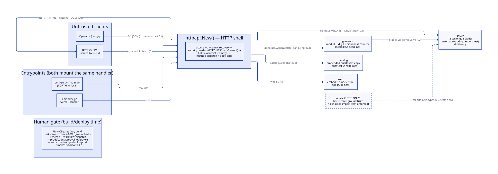

# Architecture

## Summary

sudoku-flowN is a **single stateless Go HTTP service** — a shared-core, dual-entrypoint
monolith. One handler graph (routes + middleware + embedded assets) is constructed by a
plain package function and mounted by two entrypoints: a local binary (`cmd/server`,
listening on `$PORT`) and a Vercel function (`api/index.go`). Everything the service needs
at runtime — the SPA, the seed catalog — is compiled into the binary via `embed.FS`. There
is no database, no session state, no queue, no background work: every request is a pure
function of its body plus the embedded assets, which is precisely what a cross-iteration
benchmark requires.

The topology is a **layered core with a thin HTTP shell**. The core is the `solver`
package: the grid/candidate model and the 13-technique constructive ladder, importing
nothing but the standard library and containing zero backtracking code — that absence is
enforced by an import-graph test, not convention. Around it sit `generate` (randomized
dig-and-grade generation; the only place backtracking exists in shipped code, sealed
behind its package boundary), `catalog` (embedded seed corpus), and `web` (embedded UI
assets). The `httpapi` package owns the entire HTTP surface: the frozen `/v1` wire
contract, the error envelope, and the hardening middleware chain. `oracle` is a test-only
brute-force solver used as ground truth by the replay verifier; a test asserts no shipped
package imports it. No `internal/` directories exist anywhere — AUDIT.md A2 makes
`internal/` the one failure mode a local build cannot reproduce on Vercel's classic
builder, and this project has no API-hiding need that would pay for that risk.

The **contract surface** is frozen at two levels. At the wire: the `/v1` JSON shapes,
status enums, error envelope, and HTTP codes defined in the PRD and pinned by
ADR-0004…ADR-0008 — declared as Go structs in `solver/event.go` (event/log shapes, which
are simultaneously domain types and wire types) and `httpapi/contracts.go` (request/
response wrappers, envelope). Breaking changes mint `/v2`; additive changes are forbidden
on `/v1` entirely because byte-comparability across NerdFlow iterations is the product.
In-process: `solver.Solve`, `generate.Generate`, `catalog.Sections`, and `web.FS` are the
four seams the HTTP shell consumes; each is a named contract below.

**Trust boundary posture:** exactly one boundary — the HTTP edge. Untrusted input enters
only as request bodies (an 81-char string, a difficulty word, a puzzle list) and is
validated at parse before touching the core. The middleware chain applies, outermost-in:
access log → panic recovery → security headers (a `'self'`-only CSP with no
unsafe-inline, `Strict-Transport-Security: max-age=63072000`, frame-denial, nosniff —
values frozen in AUDIT.md S1/S3/S4) → CORS (allowlist ships empty: no ACAO header
is ever emitted, no Origin echoed) → per-route method dispatch and body caps (1 MiB
uniform; Content-Length fast-path plus `MaxBytesReader` enforcement; 415 before body
read). The generator's uniqueness counter is blinded from the API surface by the
`generate` package boundary and a response-shape test. There are no human-in-the-loop
gates at runtime; the one human gate in the system is the deployment approval (CI/CD
topology below).

**Deterministic vs. model-driven:** everything at runtime is deterministic code — no LLM,
no randomness on the solve path (frozen scan orders and tie-breaks, ADR-0007). The
generator is deliberately randomized (allowed by the PRD) but its output is graded by the
same deterministic solver the API serves. Model-driven work exists only at build time (the
agents writing the code), never in the product.

**Observability posture:** one structured JSON access-log line per request (method, path,
status, duration) via `log/slog` to stdout — captured by Vercel's log drain and by the
local terminal. Solve-level observability is carried in the responses themselves (the
metric quartet + event log), which is the product's own telemetry. No tracing platform and
no cost capture: single-operator tool, near-zero budget, no cross-request state to trace
(recorded as a Known Tradeoff).

**Parallelism/scale posture:** batch validation fans out one goroutine per puzzle with
per-goroutine grid copies and zero shared mutable state; the 256-item cap is the
concurrency bound; `go test -race` gates every merge. An intra-puzzle scan-parallel solver
variant exists behind a flag solely to be benchmarked honestly as a negative result
(UC-5). Explicitly not built: horizontal scaling, caching, rate limiting beyond the caps,
auth — no UC justifies them (USERS.md).

## Diagram

```
                                 UNTRUSTED | TRUSTED
                                           |
 Operator (curl/jq) ---- /v1 JSON ---------+
 Browser SPA -------- same-origin fetch ---+--->  httpapi.New() http.Handler
 (served by GET /)                         |      +--------------------------------+
                                           |      | access log (slog, status+dur)  |
   ^                                       |      |  panic recovery -> 500 env     |
   | GET / (HTML+ext JS/CSS, embed.FS)     |      |   security headers (CSP/HSTS/  |
   |                                       |      |    frame-deny/nosniff)         |
   +---------------------------------------+      |    CORS (allowlist = empty)    |
                                                  |     method dispatch + caps     |
        entrypoints (both mount the same handler) +--------------------------------+
        cmd/server/main.go ($PORT, local)            |         |          |      |
        api/index.go (Vercel classic Handler)        |         |          |      |
                                                     v         v          v      v
                                              solver.Solve  generate. catalog. web.FS
                                              (SolveResult:  Generate  Sections (embed.FS:
                                               status,grid,  (ctx,band) ([]Section) index,
                                               events[],       |    ^      ^     app.js,
                                               quartet,grade)  |    |      |     app.css)
                                                     ^         |    | grades via
                                                     |         |    | solver.Solve
                                              zero backtracking|    |      |
                                              stdlib-only      v    |   embedded copy of
                                              (import test)  rand fill+  puzzles.txt +
                                                     ^       dig + uniq  drift test vs
                                                     |       counter     repo root
                                          TESTS ONLY |       (sealed in
                                          oracle (brute-force ground truth;
                                          no shipped package imports it — import test)

  Terminal artifacts: /v1 JSON responses (solve/generate/batch/puzzles/health),
  the embedded SPA at /, one slog access line per request.

  Human gate (build/deploy time, not runtime):
  PR -> CI gates (vet, build, test -race+cover>=80%, govulncheck) -> merge to master
     -> workflow_dispatch deploy -> production environment approval (operator)
     -> vercel deploy --prebuilt --prod -> smoke: GET /v1/health + GET /
```

## Diagram (rendered)

D2 source: `docs/diagrams/architecture.d2` · rendered: `docs/diagrams/architecture.svg`
(ELK layout, theme 0, sketch off — pinned in a comment at the top of the `.d2`).



## Contracts

### C1. The `/v1` wire contract (client → httpapi)

- **What flows:** the frozen JSON shapes: solve request/response (with `status ∈ {solved,
  invalid_input, unsolvable, stalled}`, metric quartet, `grade` always present, `events[]`
  of `{seq, technique, witnessCells[], placement?, eliminations[]?, gridAfter}` with
  0-based `{row, col}` cells and `{row, col, digit}` placements/eliminations), generate
  request/response `{puzzle, difficulty, grade}`, batch request/response, catalog
  `{sections:[{name, puzzles}]}`, health `{status, goVersion, apiVersion}`, and the error
  envelope `{error, code}` with the frozen code set `invalid_input,
  unsupported_media_type, payload_too_large, method_not_allowed, not_found,
  internal_error, generation_failed` (ADR-0004).
- **Where declared:** `httpapi/contracts.go` (wrappers + envelope) and `solver/event.go`
  (Event/cell shapes, JSON-tagged — domain type and wire type are deliberately the same
  struct so the contract has one source).
- **Producers / consumers:** httpapi produces; operator scripts, the embedded SPA, the
  future dashboard, and CI smoke tests consume.
- **Versioning rule:** `/v1` is frozen — no additive or breaking changes; any change mints
  `/v2` routes and new structs. Response struct field order is contract (encoding/json
  preserves struct order; AUDIT.md A5).
- **Blinded surfaces:** the generator's uniqueness counter and attempt counts; solver
  package internals; anything filesystem-shaped (all assets embedded).

### C2. `solver.Solve` (httpapi → solver; generate → solver)

- **What flows:** `Solve(g Grid) SolveResult` — `SolveResult{Status, Solution Grid,
  Events []Event, Iterations, EventCount, CandidateChecks int, Grade string}`. Input
  `Grid` is produced by `solver.Parse(string) (Grid, error)` which enforces the 81-char /
  1-9 / `0`-or-`.` grammar and duplicate-given rejection.
- **Where declared:** `solver/solver.go` (Solve, SolveResult), `solver/grid.go` (Grid,
  Parse), `solver/event.go` (Event).
- **Producers / consumers:** solver produces; httpapi (solve + batch handlers) and
  generate (grading) consume. Three real callers — the extraction is justified, not
  speculative.
- **Versioning rule:** Event JSON tags are wire-frozen with C1; SolveResult's Go surface
  may only grow compatibly (new fields must not alter existing JSON output on /v1).
- **Blinded surfaces:** wall-clock timing is NOT in SolveResult — `solveTimeMs` is
  measured in the handler (PRD: "measured in the handler"), keeping the core
  deterministic and the timing concern at the edge.

### C3. `generate.Generate` (httpapi → generate)

- **What flows:** `Generate(ctx context.Context, band string, rng *rand.Rand) (puzzle
  string, grade string, err error)` — returns only when the solver-computed grade equals
  the requested band; `err` on context deadline / attempt exhaustion (mapped by httpapi to
  500 `generation_failed`). httpapi supplies a 5-second context deadline (ADR-0009).
- **Where declared:** `generate/generate.go`.
- **Producers / consumers:** generate produces; httpapi's generate handler is the sole
  runtime consumer; tests consume with seeded `rng` for reproducibility.
- **Versioning rule:** signature changes are internal (not wire-visible); the wire
  contract above is what's frozen.
- **Blinded surfaces:** the backtracking full-grid filler and uniqueness counter never
  escape this package — enforced by the response-shape test (C1) and the import-graph
  test (solver imports stdlib only; nothing imports generate except httpapi and tests).

### C4. `catalog.Sections` (httpapi → catalog)

- **What flows:** `Sections() []Section` — `Section{Name string, Puzzles []string}`;
  exactly four sections with canonical names `Original, Medium, Hard, Very Hard` mapped by
  ordinal position (AUDIT.md D2), 25/10/10/10 puzzles.
- **Where declared:** `catalog/catalog.go`; embedded copy at `catalog/puzzles.txt`.
- **Producers / consumers:** catalog produces; httpapi's puzzles handler consumes; the
  drift-guard test compares the embedded copy byte-for-byte with the repo-root
  `puzzles.txt`.
- **Versioning rule:** the repo-root file is the source of truth; editing it requires
  updating the embedded copy in the same change or the drift test fails CI.
- **Blinded surfaces:** header text and comment lines (parsed away; only canonical names
  and puzzle strings are served).

### C5. `web.FS` (httpapi → web)

- **What flows:** an `embed.FS` containing `index.html`, `app.css`, `app.js` (external
  files only — the CSP forbids inline). httpapi serves it at `/` with correct MIME types.
- **Where declared:** `web/web.go` (+ `web/index.html`, `web/app.css`, `web/app.js`).
- **Producers / consumers:** web produces; httpapi consumes; the browser consumes via
  `GET /`.
- **Versioning rule:** assets version with the binary — no cache-busting scheme needed for
  a benchmark demo (responses may carry modest no-cache headers).
- **Blinded surfaces:** none (static public assets).

### C6. `oracle` (tests → oracle) — test-only

- **What flows:** `oracle.Solve(g Grid) (solution Grid, count int)` — brute-force
  solution + solution count (capped at 2) used by the replay verifier and generator tests
  as ground truth.
- **Where declared:** `oracle/oracle.go`.
- **Producers / consumers:** test code only. An import-graph test asserts no non-test
  shipped package imports it — the proof stays non-circular and the ban stays mechanical.
- **Versioning rule:** free to change; never wire-visible.
- **Blinded surfaces:** the entire package, from the shipped binary's perspective.

**Shared-infrastructure owners** (Phase 3b.2): auth — N/A by refusal (USERS.md).
Persistence — N/A (stateless; embedded read-only assets owned by `catalog` and `web`).
Observability — `httpapi` (access-log middleware); solve metrics ride the responses.
Configuration — `cmd/server` (`$PORT` is the only knob; the Vercel entrypoint takes no
config). Error envelope — `httpapi`. Transport — in-process function calls everywhere
inside the binary; HTTP only at the edge. Job/queue/scheduler — none.

## Components

- **`solver` — the constructive ladder core.** Responsibility: grid/candidate model,
  input parsing/validation (81 chars, `1-9`/`0`/`.`, duplicate-given rejection), the 13
  techniques in frozen order with frozen tie-breaks (ADR-0007), the one-event-per-pass
  solve loop, event emission, metric counting via the single counted candidate accessor,
  and grading (band of the hardest technique that fired). Explicitly does NOT: backtrack,
  count solutions, measure wall-clock time, or import anything beyond stdlib (import-graph
  test). Runtime: pure Go, deterministic. Reads: a parsed Grid. Writes: SolveResult.
  Blinded from: HTTP, randomness, the oracle. Produces C2; consumes nothing. Failure
  behavior: `invalid_input` at parse; `unsolvable` on a zero-candidate cell (literal PRD
  scope, ADR-0008); `stalled` when no technique fires on an incomplete grid; an
  already-complete valid grid is `solved` with zero passes/events and grade `"Easy"`
  (ADR-0014). Metric counters are per-solve-instance state, never package-level — the
  batch fan-out runs independent counters (ADR-0007). Also exports `SolveScanParallel`,
  reachable only from the committed benchmark and guarded by a static-scan containment
  test (ADR-0015). Lives at `solver/`.
- **`generate` — sealed generation utility.** Responsibility: randomized full-grid fill
  (backtracking), symmetric-ish clue removal with a ≤2-solution uniqueness counter,
  grade-targeted accept/retry under the caller's context deadline; grade equality with the
  request is by construction (ADR-0009). Does NOT: leak counter/attempt data, run on the
  solve path, or bias the solver. Reads: band + rng + ctx. Writes: (puzzle, grade).
  Produces C3; consumes C2 for grading. Failure: returns error on deadline/exhaustion →
  httpapi maps to 500 `generation_failed`. Lives at `generate/`.
- **`catalog` — embedded seed corpus.** Parses the embedded `puzzles.txt` copy once at
  init (headers = section boundaries, skip `#`/blank lines), serves the four
  canonically-named sections. Does NOT read the filesystem. Produces C4. Failure: a
  malformed embedded file is a startup panic (build-time defect, caught by tests — never a
  runtime condition). Lives at `catalog/`.
- **`web` — embedded UI assets.** Three static files, zero inline code, built to the
  Frontend Design Language below. Produces C5. Lives at `web/`.
- **`httpapi` — the HTTP shell and sole owner of the edge.** Responsibility: route table
  (path-only patterns + in-handler method dispatch so every /v1 error carries the JSON
  envelope, ADR-0005), the middleware chain in AUDIT.md A6 order, body caps (Content-Length
  fast-path + MaxBytesReader; batch item-cap post-parse pre-solve), content-type gate
  (415), the wire structs, `solveTimeMs` measurement, batch goroutine fan-out (one
  goroutine per puzzle, per-goroutine grid copies, results indexed into a pre-sized slice
  — no shared mutable state), and static serving. Does NOT: contain solver logic or
  generation logic. Produces C1; consumes C2–C5. Failure: panics recover to 500 envelope;
  every error path is an envelope with a frozen code. Lives at `httpapi/`.
- **`cmd/server` — local entrypoint.** `main()` reads `$PORT` (default 8080), mounts
  `httpapi.New()`, serves. Lives at `cmd/server/main.go`. Also the file Vercel's Go
  Framework Preset would detect if that model is ever adopted (AUDIT.md A1).
- **`api` — Vercel entrypoint.** `func Handler(w http.ResponseWriter, r *http.Request)`
  delegating to a package-level `httpapi.New()` handler (constructed once per instance).
  Byte-identical behavior with the local binary because both mount the same handler graph.
  Lives at `api/index.go`. `vercel.json` rewrites all paths to it.
- **`oracle` — test-only ground truth.** Bitmask backtracking solver + 2-capped solution
  counter. Consumed exclusively by tests (replay verifier, generator tests, corpus
  uniqueness assertions). Lives at `oracle/`.

**Cross-component flows.** A `/v1/solve` request: middleware → 415/caps → parse
(`solver.Parse`) → on parse failure, 400 with the FULL solve shape and
`status:"invalid_input"` (ADR-0004) → `solver.Solve` → handler measures wall clock, wraps
SolveResult into the wire shape, writes JSON. A `/v1/validate-batch` request: caps →
parse list → 413 if >256 items → fan out one goroutine per puzzle each doing
Parse+Solve on its own copy → collect in input order → aggregate counts. A `/v1/generate`
request: caps → band validation (unknown → 400 envelope) → 5s-deadline context →
`generate.Generate` (fill → dig with uniqueness counter → grade via `solver.Solve` →
accept iff grade == band) → `{puzzle, difficulty, grade}` or 500 `generation_failed`.
The UI flow: `GET /` serves the SPA; the SPA fetches `/v1/puzzles` for the dropdown and
`/v1/solve` for solving; the step-viewer renders purely from `events[].gridAfter` with no
client-side solving. The replay loop (tests): for each corpus puzzle, oracle solves it,
the verifier replays every event against its own shadow candidate state per AUDIT.md L4,
then re-runs the solve and byte-compares. Known implementation gap an honest reader needs:
the scan-parallel variant (UC-5) exists solely for the committed negative-result benchmark
— it never serves requests, and that is mechanically enforced by the ADR-0015 static-scan
containment test, not by convention.

## Storage

None. The service is stateless across requests by requirement (USERS.md refusals). The
only data at rest are two read-only assets compiled into the binary: the seed-catalog copy
(`catalog/puzzles.txt`, drift-guarded against the repo-root source of truth) and the UI
assets (`web/`). The authoritative schema source for all wire data is the Go struct
definitions in `solver/event.go` and `httpapi/contracts.go`. No migrations, no access
control beyond the HTTP edge, no transactional state to protect.

## Observability

Structured access logs: one `log/slog` JSON line per request to stdout — `method`, `path`,
`status`, `duration_ms` — emitted by the outermost middleware with a status-recording
ResponseWriter (default 200), so panicking requests still log as 500 with duration
(AUDIT.md A6). Local runs print to the terminal; Vercel captures stdout in its function
logs. Solve-level telemetry is the response itself: the metric quartet and event log are
the product's own instrumentation and the benchmark's comparison axes. Model selection:
N/A — no models at runtime. No tracing platform, no cost capture, no dashboards: a
single-operator, stateless, near-zero-budget tool (Known Tradeoff below). `/v1/health`
(`{status:"ok", goVersion, apiVersion}`) is the deployment self-identification surface
consumed by CI smoke and the future dashboard.

## CI/CD topology

**Platform** — `github-actions,vercel`.
**Config file paths** — `.github/workflows/ci.yml .github/workflows/deploy.yml vercel.json`.
**Secrets storage** — GitHub Actions Secrets: repo-scoped (`VERCEL_TOKEN`,
`VERCEL_ORG_ID`, `VERCEL_PROJECT_ID`), consumed only by the deploy workflow's
`production`-environment job; provisioned once by the operator from a local `vercel link`.
`.vercel/project.json` is never committed.

**Triggers**
- `pr:opened` / `pr:updated` — full CI gate set on every pull request.
- `push:master` — same gate set on the merged result.
- `workflow-dispatch` — the only deploy trigger (manual gate, PRD requirement).

**Gates** (all block merge via required status checks on `master` — public repo,
AUDIT.md C1)
- `vet` · runs: `go vet ./...` · pass/fail: exit code · triggers: pr, push:master.
- `build` · runs: `go build ./...` · pass/fail: exit code · triggers: pr, push:master.
- `test` · runs: `go test -race -coverprofile=coverage.out -coverpkg=./... ./...` ·
  pass/fail: exit code · triggers: pr, push:master. (Race detector mandatory per PRD.)
- `coverage` · runs: `go tool cover -func=coverage.out` total ≥ 80.0, float-safe awk
  compare (AUDIT.md C2) · pass/fail: threshold · triggers: pr, push:master.
- `security-scan` · runs: `go install golang.org/x/vuln/cmd/govulncheck@latest &&
  govulncheck ./...` (plain-text mode only — JSON modes always exit 0, AUDIT.md S5) ·
  pass/fail: exit code · triggers: pr, push:master.

**Deploy topology**
- `production` · trigger: `workflow-dispatch` (operator-initiated) · branch/tag: `master`
  only · flow: GitHub environment `production` with the operator as required reviewer
  ("prevent self-review" off — solo project), approval via the operator's authenticated
  `gh` session; then `vercel pull --yes --environment=production` → `vercel build --prod`
  → `vercel deploy --prebuilt --prod`; post-deploy smoke: `GET /v1/health` expects 200 +
  `status:"ok"` and `GET /` expects 200 `text/html`, with 5 bounded retries × 3s for cold
  start (AUDIT.md C4) · rollback surface: re-run the same deploy workflow at the prior
  master commit (no auto-rollback; failure leaves the workflow red and is acted on
  immediately by the operator) · env-var ownership: the app needs none at runtime; deploy
  credentials live in GitHub Actions Secrets, operator-provisioned.

**Deferred slots** — none. (Security scan and deploy are both live gates above.)

## Frontend Design Language

- **Surface** — the embedded SPA at `/`: puzzle grid (hero), controls (seed dropdown,
  paste, Clear, Solve), status/grade/metrics strip, statistics panel (ladder-ordered
  technique histogram), step-through viewer (transport controls, event-log list,
  technique-explanation panel with difficulty-band chip).
- **Reference kit** — the PRD itself (§In scope UI bullet) is the design-of-record; no
  external kit (DECISIONS.md D-016). This section is the token source builders copy from.
- **Aesthetic** — "McKinsey-clean": calm, near-monochrome, data-first; the grid is the
  hero; one blue accent for actions and active states; a tool, not a toy.
- **Copy recipe** — tokens (CSS custom properties in `web/app.css`): `--bg:#fff;
  --surface:#f7f7f8; --border:#e2e2e5; --text:#1a1a1a; --text-muted:#6b6b70;
  --accent:#2563eb; --accent-hover:#1d4ed8; --space-1:4px; --space-2:8px; --space-3:16px;
  --space-4:24px; --space-5:32px`. Font: `system-ui, sans-serif`. Grid: CSS Grid of 81
  `<input inputmode="numeric" maxlength="1">` cells (~48px), gap-as-gridlines technique —
  container background = line color, 1px gaps, 3px at box boundaries — for mathematically
  symmetric borders. Step-viewer cell states as classes: `.placement` (accent fill, white
  digit), `.witness` (light accent tint + 2px accent border), `.elimination` (muted tint +
  dashed border) — blue-family variants plus non-color cues, colour-blind-safe
  (DECISIONS.md D-013). All DOM writes `textContent`/`createElement`; all interactivity
  `addEventListener`; zero inline JS/CSS (CSP). Accessibility floor: per-cell
  `aria-label="Row R, Column C"`, native `<select>`/`<optgroup>` dropdown, native buttons
  with labels, `aria-live="polite"` status region, DOM order = visual order, native focus
  rings kept.
- **Exceptions** — the technique histogram is hand-rolled DOM bars (no chart library —
  dependency-free rule); the pre-solve hint is static instructional text (D-013); the
  statistics "window" is an inline panel, not a modal (D-013).

## Known Tradeoffs

- **The production approval gate is a deliberate pause, not independent review.** Solo
  operator is the only required reviewer and self-approval stays enabled; the gate's value
  is preventing accidental deploys, not adversarial review. Forced by team-of-one + PRD's
  manual-gate requirement.
- **Public repository.** Required to make "CI blocks merge" and environment approval real
  on the free tier (AUDIT.md C1, DECISIONS.md D-007). Nothing sensitive lives in the repo;
  secrets are in GitHub Actions Secrets.
- **No rate limiting, no concurrency/instance ceiling, no WAF beyond Vercel's platform
  protections.** Public read/compute endpoints on a free tier could be abused to burn
  compute (the anonymous-caller class in AUDIT.md S6); mitigations are the 1 MiB/256-item
  caps, the 5s generation deadline, sub-millisecond solves, Vercel's platform-level DDoS
  protection, and the deployment's ephemeral demo nature. The injection surface a WAF
  filters is structurally absent (no DB, no templates, inputs constrained to an 81-char
  digit grammar at parse). Adding rate limiting would complicate the timing surface being
  benchmarked. Accepted consciously; revisit if a deployment is ever long-lived.
- **No code signing on the deploy path.** Deploy trust is pinned to the single gated
  workflow instead: master-only, secrets exposed solely to the approval-gated production
  job, approval performed outside the workflow, Vercel git integration never connected
  (AUDIT.md S6, ADR-0010). For a solo-operator demo this gate is the code-signing
  substitute.
- **`stalled` deliberately conflates** above-ladder, unprovably-unsolvable, and non-unique
  grids — the PRD forbids the solution-counting needed to separate them. By design.
- **`unsolvable` is literally scoped** to zero-candidate cells; the symmetric
  hidden-analog contradiction reports `stalled` (ADR-0008). Spec-fidelity over cleverness.
- **`solveTimeMs` is excluded from byte-identity.** Wall clock cannot be deterministic;
  determinism is scoped to events + three counters (ADR-0006).
- **Vercel platform uncertainty.** Built for the classic `api/` model with a layout that
  also works under the new Go server preset; a walking-skeleton deploy spike is the first
  build piece and pins reality before anything depends on it (AUDIT.md A1/A2).
- **govulncheck is legitimately non-reproducible** — a red build may be a newly published
  CVE, not a regression (AUDIT.md S5); triage rule lives in EVAL.md.
- **No tracing/APM and no alerting.** slog access lines + response-carried metrics only;
  the deploy smoke failing the workflow is the only wired signal, and the operator acts
  on it directly. Acceptable for a stateless single-operator tool (AUDIT.md S6).
- **Static (non-/v1) 404s are plain text** from the file server; the JSON envelope
  guarantee covers the `/v1` surface and `GET /` success paths (ADR-0005).
- **Vanilla-JS UI costs several hundred lines.** The dependency-free rule buys zero
  supply-chain surface and a stable benchmark artifact at the price of hand-rolled DOM
  code; accepted by the PRD explicitly.
- **Some upper-ladder techniques may resist necessity/sufficiency isolation** (jellyfish
  named by the PRD). The fallback bar is fires-and-sound with the curation attempt
  recorded (EVAL.md); this is the PRD's own escape hatch, not a silent skip.
